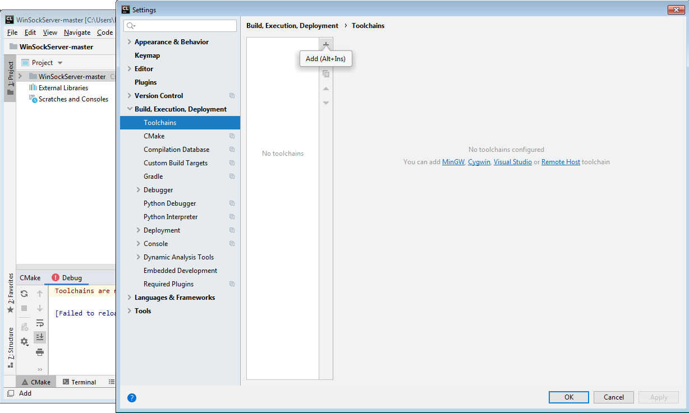
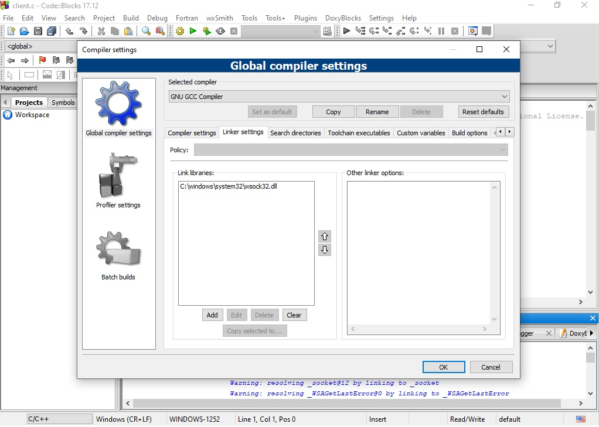
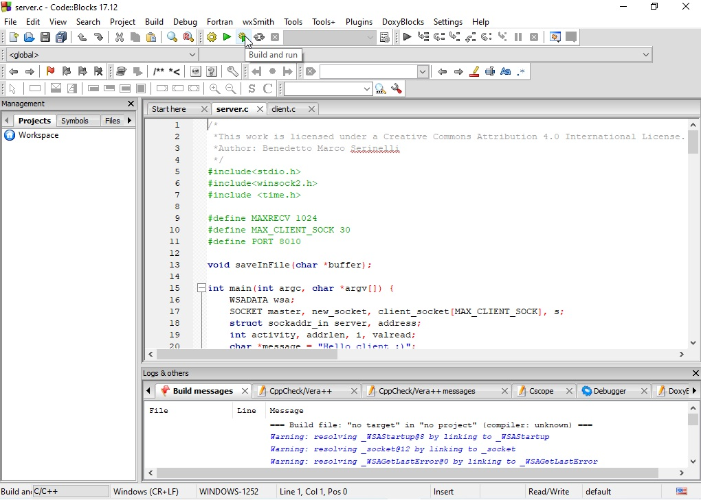
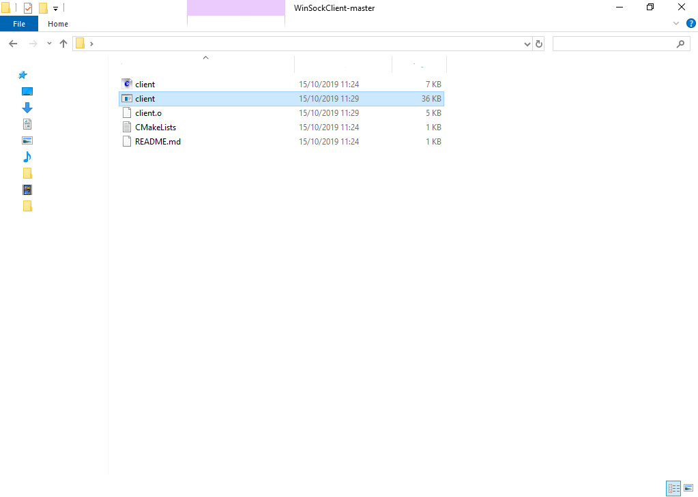

# Server WINSOCK Example of server in C. 
The client open socket, using _WINSOCK_, in order to communicate with
server. 
*ATTENTION* before launch _client_, it is *MANDATORY* that 
*SERVER* application, [see](https://github.com/marksniper/WinSockServer). The
server receive a _GREETING_ by client. The client sends a _GREETING_ to
server. The client creates new file, called _random.txt_, and writes 10
randoms number. After, client open the file, in _read mode_ and prints
on standard output the file content. If file doesn't exists, server
creates its.
## LINKS 
[Common error in WINSOCK](https://www.binarytides.com/code-tcp-socket-server-winsock/)
[Mingw](https://sourceforge.net/projects/mingw-w64/)

## INSTALLATION
1. Install CLion
Create new student account
https://www.jetbrains.com/student/ or https://www.jetbrains.com/shop/eform/students

* Insert your university email

* Download the IDE

* Download the code as ZIP

* Extract zip in a folder

* Import project as "New CMake Project from Source". Chose and select the project, navigating inside your file system. Fianlly import as "Open Existing Project"

* Download and install MinGW-w64

* Set Toolchains. File -> Settings -> Build, Execution, Deployment -> Toolchais. Click on '+'. Automatically, CLion sets up toolchains

2. Install CodeBlocksBuild and run button
* Use Code Block with GCC/G++ compiler and GDB debugger (Direct Download) link

* Install application 

* Set up linker: Settings -> Compiler -> Linker settings -> Add

* Add C:\windows\system32\wsock32.dll library

* You can click on "Build and Run" button to launch client

* You can run application from file system

## TEST
1. USE SERVER PROGRAM Download, compile, build and run the
_WINSOCK SERVER_ program, written in C, which is available in
*WINCLIENTSOCKET* repository, [link]()
## Authors
* **Benedetto Marco Serinelli** - *Initial work* 
## Acknowledgments
The code was developed with _CLion_ and another test was done with _Code
Blocks_.
